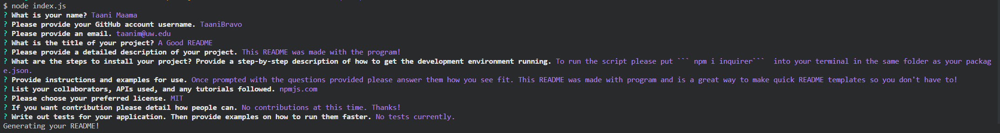

# A Good README


This README was made with the program (with some tweaks to make it pretty)!

When creating an open source project on GitHub, it’s important to have a high-quality README for the app. This should include what the app is for, how to use the app, how to install it, how to report issues, and how to make contributions&mdash;this last part increases the likelihood that other developers will contribute to the success of the project. 

You can quickly and easily create a README file by using a command-line application to generate one. This allows the project creator to devote more time to working on the project.

Your task is to create a command-line application that dynamically generates a professional README.md file from a user's input using the [Inquirer package](https://www.npmjs.com/package/inquirer). Review the [Good README Guide](../../01-HTML-Git-CSS/04-Important/Good-README-Guide/README.md) as a reminder of everything that a high-quality, professional README should contain. 

The application will be invoked by using the following command:

```bash
node index.js
```

Because this application won’t be deployed, you’ll also need to provide a link to a walkthrough video that demonstrates its functionality. Revisit the Screencastify Tutorial in the prework as a refresher on how to record video from your computer. You’ll need to submit a link to the video _and_ add it to the README of your project.

## User Story

```md
AS A developer
I WANT a README generator
SO THAT I can quickly create a professional README for a new project
```

## Acceptance Criteria

```md
GIVEN a command-line application that accepts user input
WHEN I am prompted for information about my application repository
THEN a high-quality, professional README.md is generated with the title of my project and sections entitled Description, Table of Contents, Installation, Usage, License, Contributing, Tests, and Questions
WHEN I enter my project title
THEN this is displayed as the title of the README
WHEN I enter a description, installation instructions, usage information, contribution guidelines, and test instructions
THEN this information is added to the sections of the README entitled Description, Installation, Usage, Contributing, and Tests
WHEN I choose a license for my application from a list of options
THEN a badge for that license is added near the top of the README and a notice is added to the section of the README entitled License that explains which license the application is covered under
WHEN I enter my GitHub username
THEN this is added to the section of the README entitled Questions, with a link to my GitHub profile
WHEN I enter my email address
THEN this is added to the section of the README entitled Questions, with instructions on how to reach me with additional questions
WHEN I click on the links in the Table of Contents
THEN I am taken to the corresponding section of the README
```


## Table of Contents
* [Installation](#installation)
* [Usage](#usage)
* [Credits](#credits)
* [License](#license)
* [Questions](#questions)
* [Contributing](#contributing)
* [Tests](#tests)

## Installation
To run the script please put ``` npm i inquirer```  into your terminal in the same folder as your package.json. 

## Usage
Once prompted with the questions provided please answer them how you see fit. This README was made with program and is a great way to make quick README templates so you don't have to!



## Credits
npmjs.com

## License
MIT License

      Copyright (c) 2020, Taani Maama
      
      Permission is hereby granted, free of charge, to any person obtaining a copy
      of this software and associated documentation files (the "Software"), to deal
      in the Software without restriction, including without limitation the rights
      to use, copy, modify, merge, publish, distribute, sublicense, and/or sell
      copies of the Software, and to permit persons to whom the Software is
      furnished to do so, subject to the following conditions:
      
      The above copyright notice and this permission notice shall be included in all
      copies or substantial portions of the Software.
      
      THE SOFTWARE IS PROVIDED "AS IS", WITHOUT WARRANTY OF ANY KIND, EXPRESS OR
      IMPLIED, INCLUDING BUT NOT LIMITED TO THE WARRANTIES OF MERCHANTABILITY,
      FITNESS FOR A PARTICULAR PURPOSE AND NONINFRINGEMENT. IN NO EVENT SHALL THE
      AUTHORS OR COPYRIGHT HOLDERS BE LIABLE FOR ANY CLAIM, DAMAGES OR OTHER
      LIABILITY, WHETHER IN AN ACTION OF CONTRACT, TORT OR OTHERWISE, ARISING FROM,
      OUT OF OR IN CONNECTION WITH THE SOFTWARE OR THE USE OR OTHER DEALINGS IN THE
      SOFTWARE.

---
## Questions
If you have any questions or concerns reach me on [Github](github.com/TaaniBravo) or through email at <taanim@uw.edu>.

## Contributing
No contributions at this time. Thanks!

## Tests
No tests currently.
